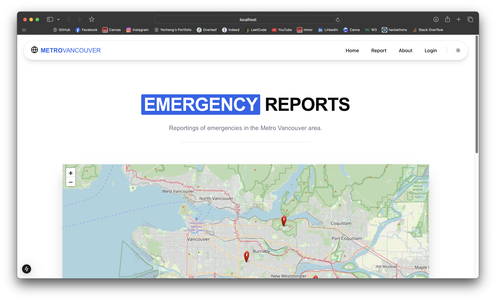
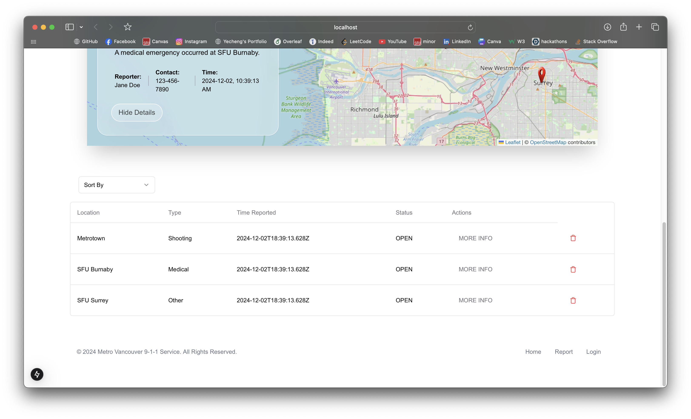

# CMPT272 SFU Fall 2024 Project 🚀

### Project Team Members

- Yecheng Wang
- Ryota Kato
- Atulya Malhan
- Pal Rohit Tilva
- Ekansh Chawla

### Metro Vancouver 9-1-1 Emergency Call Web Application 🚨

###### View more screenshots in the _project-screenshots_ folder

This repository contains the web application project developed as a final project for CMPT272 at SFU, for the Metro Vancouver 9-1-1 Emergency Call Answer Service which aims to replace the legacy system with a user-friendly web-based solution for emergency call management.

## Project Overview 📚

The Metro Vancouver 9-1-1 Emergency Call Answer Service enables both civilians and first responders to report, monitor, and manage emergency calls online, improving response efficiency and transparency.

- **Reporting Person’s Info**: Name and phone number of the witness.
- **Emergency Info**: Nature of the emergency (fire, shooting, vehicle accident, medical, etc.)
- **Location**: A specific address or place name, optionally including longitude and latitude, pinpointing the incident's site.
- **Picture Link**: An optional URL to an image of the emergency.
- **Comments**: Additional details, such as "suspect is wearing cargo shorts with green t-shirt"

Upon submission, the system logs the report with the above details and auto-fills two additional fields:

- **Time/Date**: The date and time when the report was lodged.
- **Status**: Initially set to OPEN.

E-Comm operators review new reports and respond accordingly. After an emergency has been addressed, E-Comm operators update the report status to "RESOLVED," which requires a valid passcode (see below).

## User Requirements 👤

1. A map shall display all reported emergencies with markers. The list of all emergencies shall also be shown and is sortable. As the map is zoomed in or out, the list changes to show only the emergencies currently in the map. A possible design is shown in Figure 1, but you are free to be more creative.
2. Interacting with a marker shall display the details, as shown in Figure 2. Again, you are free to be more creative.
3. Clicking on a list item shall also display the details and highlight the corresponding marker on the map.
4. Options to modify or delete reports shall be available with a valid passcode that the system shall prompt the user to enter for those operations. You can initially set the password to what you want.
5. The system shall give feedback on incorrect inputs or error situations.

## Non-Functional Requirements

- The MD5 hash shall be used for passcode storage and verification.
- You shall use the DOM Storage API to save your data.
- You shall use the Leaflet maps API with OpenStreetMaps to display the reports.

### Resources 🔗

- [Metro Vancouver 9-1-1 Service](https://metrovancouver.org/services/emergency-management/9-1-1-service)
- [Hashify (MD5)](https://hashify.net/)
- [Leaflet Documentation](https://leafletjs.com/reference.html)
